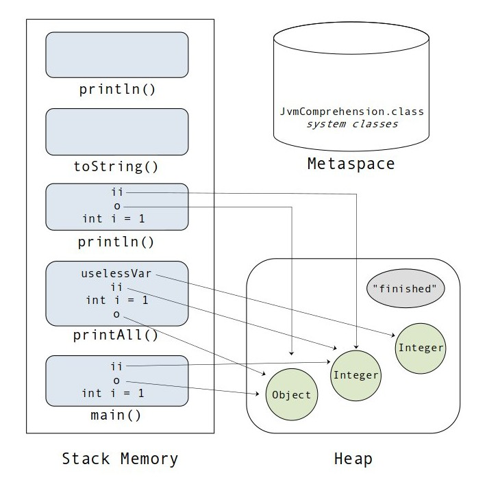

# Задача "Понимание JVM"

## Описание
Просмотрите код ниже и опишите (текстово или с картинками) каждую строку с точки зрения происходящего в JVM  

## Код для исследования
```java

public class JvmComprehension {

    public static void main(String[] args) {
        int i = 1;                      // 1
        Object o = new Object();        // 2
        Integer ii = 2;                 // 3
        printAll(o, i, ii);             // 4 
        System.out.println("finished"); // 7
    }

    private static void printAll(Object o, int i, Integer ii) {
        Integer uselessVar = 700;                   // 5
        System.out.println(o.toString() + i + ii);  // 6
    }
}

```

## Визуализация


## Ход выполнения программы
1. В стеке во фрейме `main` создается примитивная переменная.
2. При вызове конструктора `new Object()` в куче создается объект типа `Object`, под него выделяется память. В переменную `o` кладется ссылка на созданный объект, переменная хранится в стеке во фрейме `main`.
3. В куче создается объект типа  `Integer` и в момент присваивания ссылка присваевается переменной `ii`, которая лежит в стеке во фрейме `main`.
4. В стеке создается новый фрейм `printAll` и заполняется переменными, для ссылочных переменных создаются дополнительные ссылки, и сами переменные заново создаются в новом фрейме.
5. В куче создается объект типа  `Integer` и в момент присваивания ссылка присваевается переменной `uselessVar`, которая лежит в стеке во фрейме `printAll`.
6. Создаются новые фреймы при вызове `println()` и `toString()` соответственно. Фрейм `println` заново заполняется переменными.  После чего выполнение метода `printAll()` заканчивается, фреймы с переменными удаляются.
7. Создается еще один фрейм после вызова метода `println()`, строка хранится где-то в куче (string pool?). После этого этапа выполнение программы завершается, стек очищается.

P.S. Сборщик мусора работает по расписанию и удаляет объекты, на которые больше никто не ссылается.
